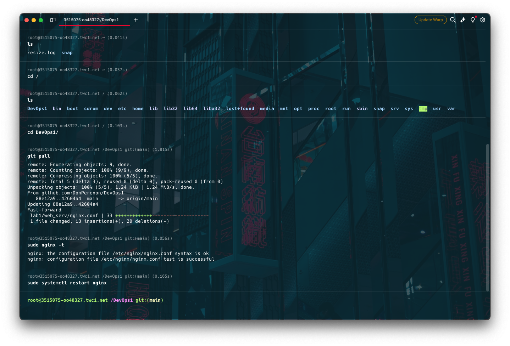

# Лабораторная работа №1 AKA (да прибудет с нами nginx)
## Требования
Настроить nginx по заданному тз:
* Должен работать по https c сертификатом
* Настроить принудительное перенаправление HTTP-запросов (порт 80) на HTTPS (порт 443) для обеспечения безопасного соединения.
* Использовать alias для создания псевдонимов путей к файлам или каталогам на сервере.
* Настроить виртуальные хосты для обслуживания нескольких доменных имен на одном сервере.
* Что угодно еще под требования проекта(опустим этот пункт :):):))

## Подготовка к работе
По совету друзяшек, у которых уже есть опыт (в отличие от нас) в развертывании сервачков, арендуем на месяц самый дешевый сервер на [timeweb](https://timeweb.cloud). Не забываем при этом, кстати, добавить в корзинку еще и дополнительный, второй публичный айпишник. 
P.S: ну вот захотелось нам заворочиться и не локально развернуть, а прямо на VDS-ке) 
Итого имеем следующее:

Для начала - неплохо, как по мне
Также, что следует отнести к подготовке, как по мне, необходимо подключиться через ssh к серверу через наш терминал, а затем там еще и ключик для гита создать, чтоб туда подтягивать все, что нам в дальнейшем понадобится) Делаем!


Ну и сразу можем, в целом, обновить apt-шку. Здесь без лишних комментариев думаю)

Перейдем к основной части наших танцев с бубном!

## Выполнение работы
apt то мы обновили, однако стоит и гвоздя нашей программы - nginx установить все таки! Делаем!!!!

Дальше чтобы сильно не заморачиваться и следуя известной фразе в сфере IT(и не только!)"работает - не трогай" варим сертификат. Какой? Ну все все понимают, я думаю) Разумеется самоподписанный! 
Юзаем команду `sudo openssl req -x509 -nodes -days 365 -newkey rsa:2048 -keyout /etc/nginx/ssl/nginx-selfsigned.key -out /etc/nginx/ssl/nginx-selfsigned.crt` и кайфуем от процесса заполнения всех полей, которые нас просят заполнить. Вводим разумеется чистую правду, ни разу не преукрашивая! В Company ITMO, конечно, ставим!

Ну а дальше начинается самое-самое интересное........
Мутим конфиг!!! Вот это действительно для нас был танец с бубном, эти слешы, нюансы alias и еще 5656453667 мелочей, до решения которых без помощи гпт или ну оооооочень прошаренного друга не дойти. Тем не менее(спойлер) мы справились!!! Итак. Пишем наш .conf файл для nginx. Пожалуй, для актуальности приложу ссылку [туть](./web_serv/nginx.conf). 
Ключевые моменты (мы ведь руководство пишем, емае!):
1. Слушаем __80 порты__ наших айпишников через `listen 194.87.56.15:80` и `listen 194.87.56.77:80;`
2. Перенаправляем их на __443 порт__ через команду `return 301 https://$host$request_uri;`
3. Указываем расположение __сертификатов__ с помощью:

`ssl_certificate /DevOps1/lab1/web_serv/cert/nginx-selfsigned.crt`

`ssl_certificate_key /DevOps1/lab1/web_serv/cert/nginx-selfsigned.key`

4. Настраиваем __alias__ на файлы, которые мы хотим, собственно говоря, увидеть при открытии нашей крутой(безопасной, блинб, 443 порт как-никак) странички)
```
location / {
    alias /DevOps1/lab1/site1/;
}
```

И вот, мы, счастливые и думающие, что все сейчас заработает вбиваем команду `nging -t`, чтобы понять, все ли окей, и __даже__ получаем ответ, что все ок:

Снова стартуем с помощью `sudo systemctl restart nginx` и... видим в браузере нечто подобное:

Чешем репой, чешем, ~~гуглим, пишем друзьям~~, и понимаем, что надо провернуть еще одно __действие__, а именно сделать так, чтобы основной конфигурационный файл nginx-а __увидел наш__ файлик. С помощью команды include внутри основного .conf прописываем путь до нашего конф. файла, и уже хотя бы просто получаем дефолтную страничку nginx-a.


Медленно, но продвигаемся к цели!
Так как мы думаем, что все сделали правильно, недоумеваем - почему nginx не выводит нам те html файлы, которые мы ожидаем??? Повторяем способ __чесания репы__ и понимаем, что нам нужны логи! Ведь явно есть какая-то ошибка!!!(спойлер: чтоб не захломлять наш конф. файл, мы затем их удалили, но через коммиты можно посмотреть, что они действительно у нас были:)) И в логах видим следующее:

Понимаем, что не следует называть файлы first_file.html и secon_file.html, тк это, _видимо_ смущает alias, называем их просто first.html и second.html.
Повторяем наши уже излюбленные команды `nging -t && sudo systemctl restart nginx`, молимся всем земным и неземным богам и получаем нашу заветную цель: замочки в поисковой строке браузера у наших айпишничков:


# Итоги
Мы смогли разобраться с nginx, alias, перенаправлением с 80 прорта на 443 и не умерли от скуки, заполняя поля при создании самоподписанного сертификата. В целом, это было весело и интересно) Пришлось посидеть пару вечеров, признаемся)))
А вот и фотка самого nginx - мы за кадром, чуть ниже(


